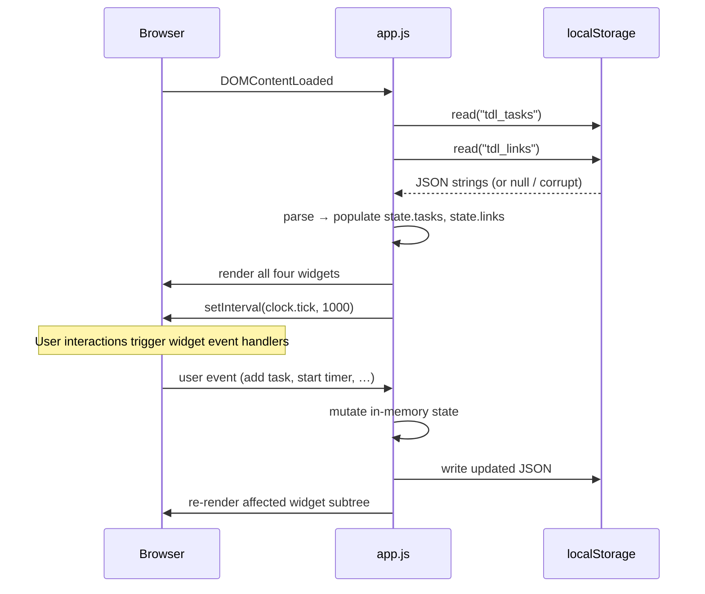

# Design Document: Todo Life Dashboard

## Overview

The Todo Life Dashboard is a zero-dependency, single-page productivity application delivered as three static files (`index.html`, `css/style.css`, `js/app.js`). It runs entirely in the browser — no server, no build step, no third-party libraries. All state lives in memory during a session and is persisted to the browser's `localStorage` API under two fixed keys (`tdl_tasks`, `tdl_links`).

The application is composed of four independent widgets rendered inside one HTML page:

| Widget | Purpose |
|---|---|
| **Greeting & Clock** | Live time/date display with contextual greeting |
| **Focus Timer** | Pomodoro-style 25-minute countdown |
| **Task Manager** | CRUD to-do list with persistence |
| **Quick Links** | Saved URL shortcut buttons |

Each widget owns its own subtree of the DOM, its own in-memory state slice, and its own Storage read/write calls. Widgets communicate only through the shared Storage layer — there is no cross-widget event bus required.

---

## Architecture

### File Structure

```
project-root/
├── index.html          ← single HTML entry point; widget markup skeletons
├── css/
│   └── style.css       ← all styling, variables, layout, responsive rules
└── js/
    └── app.js          ← all JavaScript: state, logic, DOM manipulation, events
```

### Module Organisation within `app.js`

Because the project is vanilla JS with no module bundler, `app.js` is structured as a single IIFE (Immediately Invoked Function Expression) that exposes nothing to global scope. Internally it is divided into clearly labelled sections:

```
app.js
│
├── [1] CONSTANTS & CONFIG
│   └── Keys, defaults (TIMER_DEFAULT_SECONDS = 1500, MAX_LINKS = 20, …)
│
├── [2] STORAGE MODULE
│   └── storage.read(key), storage.write(key, data), storage.isAvailable()
│
├── [3] STATE
│   └── state.tasks[], state.links[], state.timer{}, state.clock{}
│
├── [4] GREETING / CLOCK WIDGET
│   └── clock.init(), clock.tick(), clock.getGreeting(hour)
│
├── [5] TIMER WIDGET
│   └── timer.init(), timer.start(), timer.stop(), timer.reset(),
│       timer.tick(), timer.render()
│
├── [6] TASK MANAGER WIDGET
│   └── tasks.init(), tasks.add(desc), tasks.edit(id, desc),
│       tasks.toggle(id), tasks.delete(id), tasks.render()
│
├── [7] QUICK LINKS WIDGET
│   └── links.init(), links.add(label, url), links.delete(id),
│       links.render(), links.validateUrl(url)
│
├── [8] STORAGE SYNC HELPERS
│   └── syncTasks(), syncLinks()
│
└── [9] BOOTSTRAP
    └── DOMContentLoaded → init all widgets
```

### Execution Flow



---

## Components and Interfaces

### Greeting / Clock Widget

**Responsibilities:** Display live time (HH:MM:SS), date, and a greeting that depends on the current local hour. Update every second.

**Key functions:**

```
clock.init()
  - Caches DOM refs for time, date, greeting elements
  - Calls clock.tick() immediately
  - Schedules setInterval(clock.tick, 1000)

clock.tick()
  - Reads new Date()
  - Formats time as HH:MM:SS (zero-padded)
  - Formats date as "Weekday, D Month YYYY" (no zero-pad on day)
  - Calls clock.getGreeting(hour) → greeting string
  - Updates DOM text content
  - Handles Date() failure → shows error message

clock.getGreeting(hour: number): string
  - hour 5–11  → "Good Morning"
  - hour 12–17 → "Good Afternoon"
  - hour 18–20 → "Good Evening"
  - hour 21–23 or 0–4 → "Good Night"
```

**DOM elements used:**
- `#clock-time` — time display
- `#clock-date` — date display
- `#clock-greeting` — greeting text
- `#clock-error` — hidden error message container

---

### Focus Timer Widget

**Responsibilities:** Countdown from 25:00, with Start / Stop / Reset controls. Enforce button states per timer phase. Display session-complete indicator on expiry.

**Timer state object:**

```js
state.timer = {
  remaining: 1500,   // seconds remaining
  running: false,    // whether interval is active
  intervalId: null   // reference to setInterval handle
}
```

**Key functions:**

```
timer.init()
  - Caches DOM refs
  - Renders initial 25:00 display
  - Binds click handlers on Start, Stop, Reset buttons

timer.start()
  - Guard: if remaining === 0, reset first
  - Sets state.timer.running = true
  - Stores setInterval(timer.tick, 1000) in intervalId
  - Updates button disabled states
  - Calls timer.render()

timer.stop()
  - clearInterval(intervalId)
  - Sets running = false
  - Updates button disabled states

timer.reset()
  - Calls timer.stop()
  - Sets remaining = 1500
  - Hides session-complete indicator
  - Calls timer.render()

timer.tick()
  - Decrements remaining by 1
  - If remaining <= 0: clamp to 0, call timer.stop(),
    show session-complete indicator
  - Calls timer.render()

timer.render()
  - Formats remaining as MM:SS
  - Sets display text
  - Applies/removes 'timer--complete' class
  - Syncs button disabled attributes:
      Start:  disabled while running
      Stop:   disabled while NOT running
      Reset:  disabled while running
```

**DOM elements used:**
- `#timer-display` — MM:SS countdown text
- `#timer-start` — start button
- `#timer-stop` — stop button
- `#timer-reset` — reset button
- `#timer-complete` — session-complete indicator (hidden by default)

---

### Task Manager Widget

**Responsibilities:** Add, edit, complete, and delete tasks. Validate input. Sync to `localStorage` after every mutation. Load from storage on init.

**Task object shape (in-memory and in JSON):**

```js
{
  id: string,          // crypto.randomUUID() or Date.now() fallback
  description: string, // 1–500 chars, trimmed
  completed: boolean   // default: false
}
```

**Key functions:**

```
tasks.init()
  - Reads state.tasks from storage (already populated at boot)
  - Caches DOM refs
  - Binds submit handler on add-form
  - Calls tasks.render()

tasks.add(description: string)
  - Validates: trim → reject if empty or length > 500
  - Creates task object with new UUID
  - Pushes to state.tasks
  - Calls syncTasks()
  - Calls tasks.render()

tasks.edit(id: string, newDescription: string)
  - Validates: trim → reject if empty or length > 500
  - Finds task by id in state.tasks
  - Updates description; preserves id and completed
  - Calls syncTasks()
  - Calls tasks.render()

tasks.toggle(id: string)
  - Flips task.completed boolean
  - Calls syncTasks()
  - Calls tasks.render()

tasks.delete(id: string)
  - Removes task from state.tasks by id
  - Calls syncTasks()
  - Calls tasks.render()

tasks.render()
  - Clears the task list container
  - For each task in state.tasks, creates a list item with:
      - Checkbox (bound to toggle)
      - Description text (strikethrough when completed)
      - Edit button → switches to inline edit mode
      - Delete button
  - Inline edit mode: replaces text with <input> + confirm/cancel
```

**DOM elements used:**
- `#task-input` — new task text field
- `#task-submit` — add task button
- `#task-error` — inline validation message
- `#task-list` — `<ul>` container for rendered task items
- `#task-storage-error` — storage failure message

---

### Quick Links Widget

**Responsibilities:** Add, display, and delete URL shortcut buttons. Validate label and URL. Enforce 20-link cap. Sync to `localStorage`.

**Link object shape:**

```js
{
  id: string,     // crypto.randomUUID() or Date.now() fallback
  label: string,  // 1–50 chars
  url: string     // starts with http:// or https://, max 2048 chars
}
```

**Key functions:**

```
links.init()
  - Reads state.links from storage
  - Caches DOM refs
  - Binds submit handler on add-form
  - Calls links.render()

links.validateUrl(url: string): boolean
  - Returns true if url starts with "http://" or "https://"

links.add(label: string, url: string)
  - Validates label: non-empty, ≤50 chars
  - Validates url: non-empty, passes validateUrl, ≤2048 chars
  - Enforces MAX_LINKS (20) cap
  - Creates link object with new UUID
  - Pushes to state.links
  - Calls syncLinks()
  - Calls links.render()
  - Clears input fields

links.delete(id: string)
  - Removes link from state.links by id
  - Calls syncLinks()
  - Calls links.render()

links.render()
  - Clears the links container
  - For each link, creates a <button> that opens url in new tab
    plus a delete control
```

**DOM elements used:**
- `#link-label-input` — label text field
- `#link-url-input` — URL text field
- `#link-submit` — add link button
- `#link-error` — inline validation message
- `#link-list` — container for rendered link buttons
- `#link-storage-error` — storage failure message

---

## Data Models

### Tasks — `localStorage` key: `tdl_tasks`

Stored as a JSON-serialised array of Task objects.

```json
[
  {
    "id": "a1b2c3d4-e5f6-7890-abcd-ef1234567890",
    "description": "Review pull requests",
    "completed": false
  },
  {
    "id": "b2c3d4e5-f6a7-8901-bcde-f12345678901",
    "description": "Write unit tests",
    "completed": true
  }
]
```

**Field constraints:**

| Field | Type | Constraints |
|---|---|---|
| `id` | string | UUID v4; unique within the array; never changes after creation |
| `description` | string | 1–500 characters; trimmed before storage |
| `completed` | boolean | `false` on creation; toggled by user action |

**Empty/corrupt state:** If key is absent or value is not valid JSON, treat as `[]` and show a warning.

---

### Links — `localStorage` key: `tdl_links`

Stored as a JSON-serialised array of Link objects.

```json
[
  {
    "id": "c3d4e5f6-a7b8-9012-cdef-123456789012",
    "label": "GitHub",
    "url": "https://github.com"
  },
  {
    "id": "d4e5f6a7-b8c9-0123-defa-234567890123",
    "label": "MDN Docs",
    "url": "https://developer.mozilla.org"
  }
]
```

**Field constraints:**

| Field | Type | Constraints |
|---|---|---|
| `id` | string | UUID v4; unique within the array |
| `label` | string | 1–50 characters |
| `url` | string | Must start with `http://` or `https://`; max 2048 characters |

**Array constraint:** Maximum 20 entries; additions are rejected beyond this limit.

---

### In-Memory State Shape

```js
const state = {
  tasks: [],        // Task[]  — loaded from tdl_tasks on boot
  links: [],        // Link[]  — loaded from tdl_links on boot
  timer: {
    remaining: 1500,
    running: false,
    intervalId: null
  }
  // clock has no persistent state; reads new Date() on every tick
};
```

---

### Storage Module Interface

```js
const storage = {
  isAvailable() → boolean,
  read(key: string) → any | null,
  write(key: string, data: any) → boolean   // returns false on failure
};
```

- `isAvailable()`: tries a test `setItem`/`removeItem` in a try/catch.
- `read(key)`: calls `localStorage.getItem`, JSON-parses, returns `null` on missing key or parse failure (and records whether the failure was a parse error for the corruption warning).
- `write(key, data)`: JSON-stringifies and calls `localStorage.setItem` in a try/catch; returns `false` and triggers error UI on failure.

---

## CSS Architecture

### File Layout (`css/style.css`)

```
style.css
│
├── [1] CUSTOM PROPERTIES (design tokens)
│   ├── --color-bg, --color-surface, --color-primary, --color-text, --color-muted
│   ├── --font-base, --font-mono          (max 2 font families + system fallbacks)
│   ├── --radius, --shadow
│   └── --spacing-xs(4px) through --spacing-xl(48px) (8px scale)
│
├── [2] RESET / BASE
│   └── box-sizing, margin reset, base font-size (16px), line-height
│
├── [3] LAYOUT
│   ├── .dashboard — CSS Grid container
│   ├── Mobile-first: single column
│   └── @media (min-width: 768px): 2-column grid
│
├── [4] WIDGET BASE
│   └── .widget — card style, spacing, border-radius, min-width: 280px
│
├── [5] WIDGET-SPECIFIC
│   ├── .widget--greeting
│   ├── .widget--timer
│   ├── .widget--tasks
│   └── .widget--links
│
├── [6] COMPONENT STYLES
│   └── buttons, inputs, checkboxes, error messages, focus indicators
│
└── [7] UTILITY / STATE CLASSES
    └── .is-hidden, .task--completed (strikethrough), .timer--complete
```

### Responsive Strategy

- **Mobile-first**: base styles target 320px+.
- **Breakpoint at 768px**: switches `.dashboard` to `grid-template-columns: repeat(2, 1fr)`.
- All widgets use `min-width: 280px` and `max-width: 100%` of their grid cell.
- Typography: body text ≥ 14px, inputs ≥ 16px (prevents iOS zoom).
- No horizontal scroll: `overflow-x: hidden` on `body`; content uses `max-width: 1440px` centered.

### Color Palette (≤5 colors)

| Token | Role |
|---|---|
| `--color-bg` | Page background (e.g. `#f5f5f5`) |
| `--color-surface` | Widget card background (e.g. `#ffffff`) |
| `--color-primary` | Accent / interactive (e.g. `#4f6ef7`) |
| `--color-text` | Primary body text (e.g. `#1a1a2e`) |
| `--color-muted` | Secondary text / disabled states (e.g. `#6b7280`) |

### Focus Indicators

All interactive elements get:
```css
:focus-visible {
  outline: 2px solid var(--color-primary);
  outline-offset: 2px;
}
```
The primary color is chosen to meet 3:1 contrast against the surface background.

---

## State Management

There is no reactive framework. State flows in one direction:

```
User Action
    ↓
Event Handler (widget module)
    ↓
Mutate state slice (state.tasks / state.links / state.timer)
    ↓
Persist to localStorage (syncTasks / syncLinks)
    ↓
Re-render affected widget subtree (tasks.render / links.render / timer.render)
    ↓
DOM updated
```

**Rendering is always full-subtree for the affected widget.** Each `render()` function clears its container and rebuilds all items from the current in-memory state. This avoids diff complexity while being performant for the expected data scale (≤500 tasks, ≤20 links).

**Clock does not use state.** It reads `new Date()` on every tick and directly updates the DOM — there is nothing to persist.

**Timer state is intentionally not persisted.** The timer resets to 25:00 on every page load per the Pomodoro convention and the requirements (no requirement for timer persistence exists).

---

## Event Flow Diagrams

### Task Add Flow

```
[User types in #task-input]
    → [User clicks #task-submit or presses Enter]
        → tasks.add(inputValue)
            → validate (trim, length check)
                FAIL → show #task-error, return
                PASS → create Task object
                      → push to state.tasks
                      → syncTasks() → storage.write('tdl_tasks', state.tasks)
                          FAIL → show #task-storage-error, rollback push
                          PASS → tasks.render() → rebuild #task-list DOM
                      → clear #task-input
                      → hide #task-error
```

### Timer Control Flow

```
[Start clicked]
    → timer.start()
        → if remaining === 0: timer.reset() first
        → setInterval(timer.tick, 1000) stored in state.timer.intervalId
        → state.timer.running = true
        → update button states (Start disabled, Stop enabled, Reset disabled)

[Timer tick (every 1000ms)]
    → state.timer.remaining -= 1
    → if remaining <= 0:
          clamp to 0
          timer.stop()
          show #timer-complete
    → timer.render()

[Stop clicked]
    → timer.stop()
        → clearInterval(intervalId)
        → state.timer.running = false
        → update button states (Stop disabled, Start enabled, Reset enabled)

[Reset clicked]
    → timer.reset()
        → timer.stop()
        → state.timer.remaining = 1500
        → hide #timer-complete
        → timer.render()
```

### Link Add Flow

```
[User fills #link-label-input and #link-url-input]
    → [User clicks #link-submit]
        → links.add(label, url)
            → validate label (non-empty, ≤50)
            → validate url (non-empty, http/https prefix, ≤2048)
            → check state.links.length < 20
                FAIL any → show #link-error with specific message, return
                PASS → create Link object
                      → push to state.links
                      → syncLinks() → storage.write('tdl_links', state.links)
                          FAIL → show #link-storage-error, rollback push
                          PASS → links.render() → rebuild #link-list DOM
                      → clear both input fields
                      → hide #link-error
```

---

## Error Handling

### Error Categories and Responses

| Error Scenario | Detection Point | User-Facing Response | Recovery |
|---|---|---|---|
| `localStorage` unavailable on load | `storage.isAvailable()` at boot | Non-blocking warning banner, visible ≥3 s | Continue with empty data sets |
| Corrupt JSON in `localStorage` key | `storage.read()` parse failure | Non-blocking warning: "corrupted data found" | Treat as empty array; discard bad value |
| `localStorage` write failure | `storage.write()` try/catch | Non-blocking error: "change could not be saved" | Roll back the in-memory mutation; previous saved state preserved |
| Empty/whitespace task or link input | Widget validator | Inline validation message next to input | Do not mutate state; user retains input |
| URL without http/https prefix | `links.validateUrl()` | Inline validation message | Do not mutate state; user retains input |
| Links at 20-item cap | `links.add()` length check | Inline message: "maximum limit reached" | Do not mutate state |
| `Date()` unavailable for clock | try/catch in `clock.tick()` | Error message in clock area; no partial display | Timer/tasks/links unaffected |
| JS runtime error in any widget | `window.onerror` global handler | Console error; no full-page crash | Other widgets remain functional |

### Principles

- **Fail gracefully**: any single widget failure must not crash other widgets. Each widget's `init()` is wrapped in its own try/catch so a bug in one cannot prevent the others from initialising.
- **Non-blocking warnings**: storage and load errors use a floating/inline notification styled with a distinct warning color; they auto-dismiss after 3 seconds or remain until dismissed, depending on severity.
- **Rollback on write failure**: if `syncTasks()` or `syncLinks()` fails, the mutation is removed from in-memory state before calling `render()`, keeping UI and storage consistent.
- **Input validation is synchronous**: all validation runs before any state mutation — there is no optimistic update to undo.
- **No silent failures**: every error code path produces a visible user message or a console warning; no error is silently swallowed.

---

## Correctness Properties

*A property is a characteristic or behavior that should hold true across all valid executions of a system — essentially, a formal statement about what the system should do. Properties serve as the bridge between human-readable specifications and machine-verifiable correctness guarantees.*

### Property 1: Task serialisation round-trip

*For any* array of Task objects in the in-memory state, serialising it to JSON via `syncTasks()` and then deserialising it via `storage.read('tdl_tasks')` SHALL produce an array whose tasks are structurally equal to the originals (same `id`, `description`, `completed` for each element).

**Validates: Requirements 5.1, 5.3, 5.4**

---

### Property 2: Link serialisation round-trip

*For any* array of Link objects in the in-memory state, serialising it to JSON via `syncLinks()` and then deserialising it via `storage.read('tdl_links')` SHALL produce an array whose links are structurally equal to the originals (same `id`, `label`, `url` for each element).

**Validates: Requirements 5.2, 5.3, 5.4**

---

### Property 3: Whitespace task descriptions are always rejected

*For any* string composed entirely of whitespace characters (spaces, tabs, newlines), calling `tasks.add()` with that string SHALL leave `state.tasks` unchanged (same length and same contents).

**Validates: Requirements 3.3**

---

### Property 4: Valid task addition grows the list by exactly one

*For any* current task list state and any non-empty, non-whitespace string of 1–500 characters, calling `tasks.add()` SHALL result in `state.tasks` having exactly one more element than before, and the new element SHALL contain the trimmed input string as its `description` and `false` as its `completed` value.

**Validates: Requirements 3.2**

---

### Property 5: Task toggle is idempotent over two applications

*For any* task in `state.tasks`, calling `tasks.toggle(id)` twice in succession SHALL return the task's `completed` field to its original value — i.e., `toggle ∘ toggle = identity` on the `completed` field.

**Validates: Requirements 3.7**

---

### Property 6: Task edit preserves identity and completion state

*For any* task in `state.tasks` and any valid replacement description (1–500 non-whitespace characters), calling `tasks.edit(id, newDesc)` SHALL leave the task's `id` and `completed` fields unchanged and update only its `description` field.

**Validates: Requirements 3.5**

---

### Property 7: Invalid URL links are always rejected

*For any* label/URL pair where the URL does not begin with `"http://"` or `"https://"`, calling `links.add()` SHALL leave `state.links` unchanged (same length and same contents).

**Validates: Requirements 4.4**

---

### Property 8: Links beyond the 20-item cap are rejected

*For any* state where `state.links.length === 20`, calling `links.add()` with any valid label/URL pair SHALL leave `state.links` unchanged (length remains 20).

**Validates: Requirements 4.8**

---

### Property 9: Clock greeting is total and exclusive

*For any* integer `hour` in `[0, 23]`, `clock.getGreeting(hour)` SHALL return exactly one of `{"Good Morning", "Good Afternoon", "Good Evening", "Good Night"}` — never `null`, never an empty string, and never more than one simultaneously.

**Validates: Requirements 1.3, 1.4, 1.5, 1.6**

---

### Property 10: Timer countdown never goes below zero

*For any* sequence of `timer.tick()` calls starting from any non-negative `remaining` value, `state.timer.remaining` SHALL never become negative; it SHALL be clamped to `0` and the timer SHALL stop.

**Validates: Requirements 2.7**

---

### Property 11: Timer reset always restores full duration

*For any* timer state (running, paused, or expired), calling `timer.reset()` SHALL set `state.timer.remaining` to `1500` and `state.timer.running` to `false`, regardless of the previous state.

**Validates: Requirements 2.6**

---

## Testing Strategy

### Dual Testing Approach

Testing uses both example-based unit tests and property-based tests, targeting the pure logic in `app.js` without a DOM environment.

**Unit tests** cover specific scenarios, integration points, and edge cases: error message display, button disabled state transitions, Storage unavailability paths, and individual widget initialisation.

**Property tests** cover the universal properties listed above. They run 100+ iterations each, generating random but valid (and invalid) inputs to validate that the core invariants hold across a wide input space.

### Test Environment

- **Runtime**: Node.js (no browser required for logic tests)
- **Unit test framework**: [Vitest](https://vitest.dev/) — zero-config, ES module friendly
- **Property-based testing library**: [fast-check](https://fast-check.dev/) — mature, well-maintained, works in Node without a DOM

### Unit Test Coverage

| Area | What is tested |
|---|---|
| `clock.getGreeting` | All four hour boundary conditions with representative examples |
| `storage.read` | Missing key returns null; corrupt JSON returns null + corruption flag |
| `storage.write` | Write failure (mocked `setItem` throws) returns false and does not corrupt state |
| `tasks.add` | Empty string, whitespace-only, >500 chars are rejected; valid input is accepted |
| `tasks.edit` | Preserves id and completed; rejects empty replacement |
| `tasks.toggle` | Flips boolean correctly |
| `tasks.delete` | Removes by id; no-op for unknown id |
| `links.add` | Missing label, missing url, invalid url prefix, at-cap rejection |
| `links.delete` | Removes by id |
| `timer.start/stop/reset` | State transitions; `remaining` never negative |
| Error handling | Storage-unavailable paths produce correct error state |

### Property-Based Test Configuration

Each property-based test:
- Runs **minimum 100 iterations** (fast-check default: 100; can be raised for CI)
- Is tagged with a comment in the format:
  ```js
  // Feature: todo-life-dashboard, Property N: <property text>
  ```
- Uses fast-check arbitraries to generate:
  - Random strings of varying length and character content
  - Random Task / Link arrays
  - Random hour values in `[0, 23]`
  - Random timer `remaining` values in `[0, 1500]`

### Test File Structure

```
tests/
├── unit/
│   ├── clock.test.js
│   ├── timer.test.js
│   ├── tasks.test.js
│   ├── links.test.js
│   └── storage.test.js
└── property/
    ├── serialisation.property.test.js   (Properties 1, 2)
    ├── tasks.property.test.js           (Properties 3, 4, 5, 6)
    ├── links.property.test.js           (Properties 7, 8)
    ├── clock.property.test.js           (Property 9)
    └── timer.property.test.js           (Properties 10, 11)
```

### Test Coverage Goals

- All acceptance criteria in Requirements 1–5 covered by at least one unit or property test
- All 11 correctness properties have a corresponding property-based test
- Requirements 6 (layout/visual) and 7 (technical constraints) are validated by cross-browser manual smoke tests, not automated tests — visual layout and CSS compliance cannot be meaningfully property-tested
